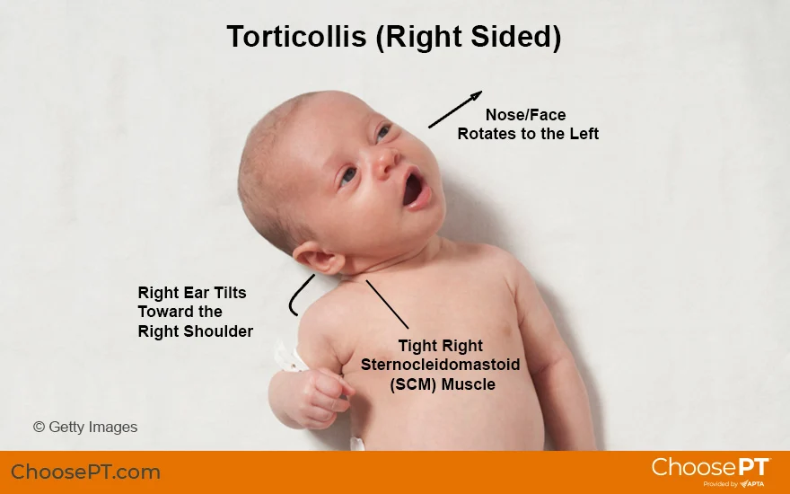

Congenital Muscular Torticollis (CMT) is a nonprogressive unilateral contracture of particular neck musculature. The muscles involved in CMT are the sternocleidomastoid, scalenes, and upper trapezius. What is seen in CMT is a postural asymmetry due to the tightness of these muscles on one side. It presents as ipsilateral cervical lateral flexion, also known as side-bending, along with contralateral cervical rotation. There are variations in this pattern but the most common CMT presentation is characterized by a side-bending “tilt” with a rotation to the opposite side of the tilt.

## Etiology

The etiology of congenital torticollis remains unknown but there the most cited causes are ischemia, trauma during childbirth and malpositioning of the fetus during pregnancy (Mendez et al). The most common cause is thought to be intrauterine deformation. It is associated more with first pregnancies, situations that would result in less space for the growing infant(s) such as a multiple pregnancy, compression syndromes, etc. CMT can be classified into 3 types: postural (20%), muscular (30%) or sternocleidomastoid mass (50%). Postural meaning that the child has a postural preference but no range of motion restriction or muscle tightness. Muscular meaning there is tightness in the sternocleidomastoid and a restriction of range of motion. A sternocleidomastoid mass would show a thickened muscle along with a restriction of range of motion (Mendez et al). 

