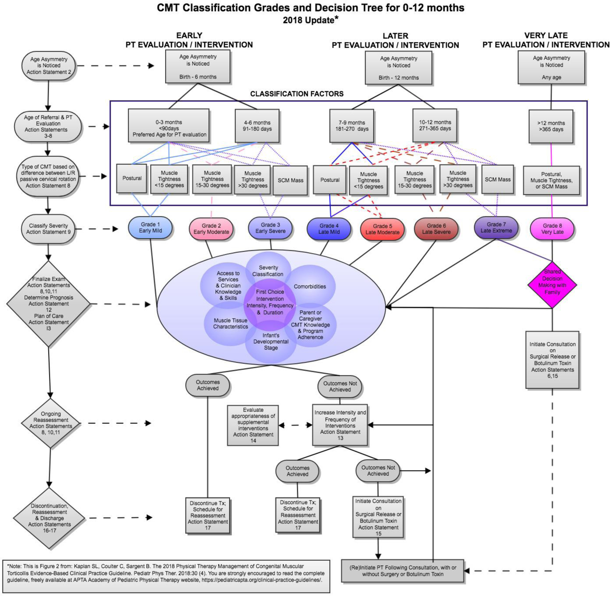

## Incidence

Congenital muscular torticollis means that it appears at or right after birth within a few weeks with no reason. 3-16% of all infants are going to have CMT. The incidence of CMT has increased since the “back to sleep” program which encourages parents to put their infants on their backs when sleeping (Losee & Mason, 2005). In order to counteract this, it is important for parents and other caregivers to allow the child to have adequate tummy time while awake. This is because tummy time inspires the child to use their neck extensors, lift their heads and turn. In supine (on their backs), the child is more likely to let their head fall in the most comfortable position. 

## Identification & Co-Occurrences

Before diagnosing an infant with CMT, other and more serious diagnoses must be ruled out. The reason being is that there are diagnoses that present similar to CMT. These include posterior fossa tumors, sandifer’s syndrome, ocular conditions, infections, neurological dystonias, and more (Mendez et al). 

Other common co-occurrences include hip dysplasia, brachial plexus injury, vision/hearing deficits, gastrointestinal issues (reflux), skin breakdown, yeast infections, and cranial deformities. Cranial deformities have a 90% co-occurrence with CMT and consist of types such as: plagiocephaly, brachycephaly and dolichocephaly. Plagiocephaly is described as flat on one side while rounder on the other side. Brachycephaly presents as a wide back of the head. Dolichocephaly is characterized by a more narrow head. The cranial deformity that most often occurs with CMT is plagiocephaly. Helmets are most often used as interventions in those with plagiocephaly. 

Physical examination is the most simple and effective way to achieve a diagnosis. This physical examination includes an assessment of cervical range of motion, passive and active. CMT can be graded by levels of severity: “early” (0-6 months) and “late” (>7 months). Upon age, the severity is then graded by mild, moderate or severe (Oledzka et al).

> "To use this chart: The vertically aligned ovals on the left, list the factors that are most relevant to the classification process (age asymmetry noted, age of referral and PT evaluation, type of CMT); the diamonds below describe the cycle of PT examination, intervention and reassessment. Begin in the larger rectangle with age at evaluation and type of CMT to choose a grade in the ovals below. Abbreviations: PT, physical therapy; TX, treatment; SCM, sternocleidomastoid; L/R, left/right," (Kaplan et al).
>
> --- 2018 Classification of Severity and Management of Congenital Muscular Torticollis (CMT)

> "The referral flow diagram is divided into 2 distinct time frames: Birth to 2 days, representing the newborn period, and throughout infancy, representing the typical time after discharge to home. During the newborn period, many different healthcare providers may observe the infant because they are involved in the birth and/or postnatal care. These healthcare providers are in the ideal position to observe the symmetry of the head on the shoulders and screen for passive and active movement limitations. After the infant is at home, the most likely observers will be the primary physician and the parents or other caregivers. Regardless of who performs the initial screen, infants with asymmetry should undergo an evaluation to rule out non-muscular causes of CMT. If CMT or a persistent postural preference is diagnosed, the infant should be immediately referred to a pediatric PT," (Kaplan et al).
>
> --- 2018 Algorithm for Early Identification of Congenital Muscular Torticollis and Referral to Physical Therapy
